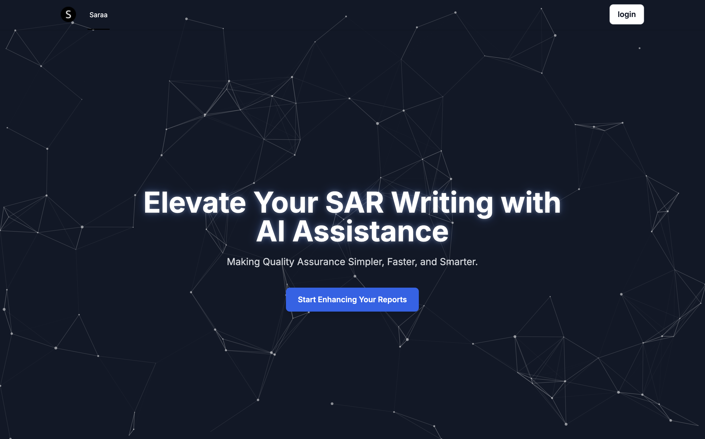
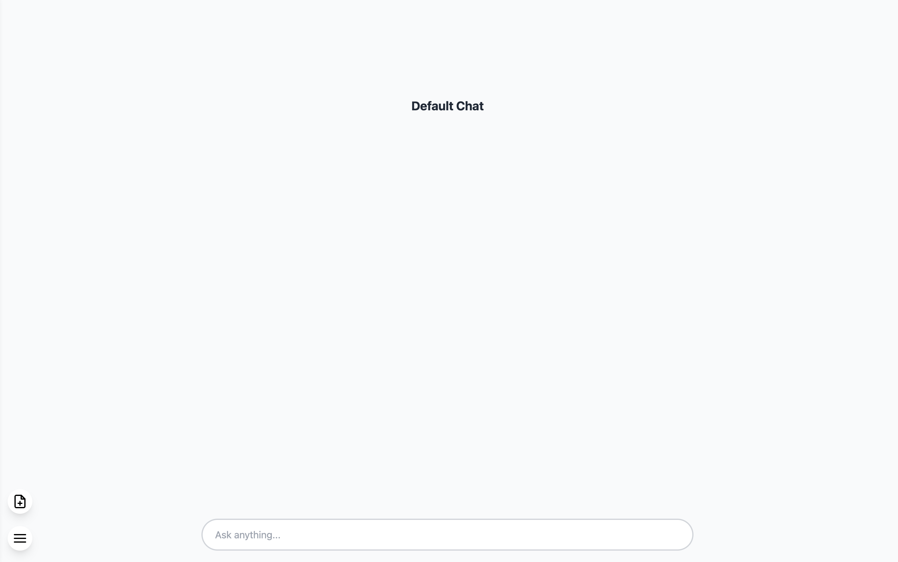
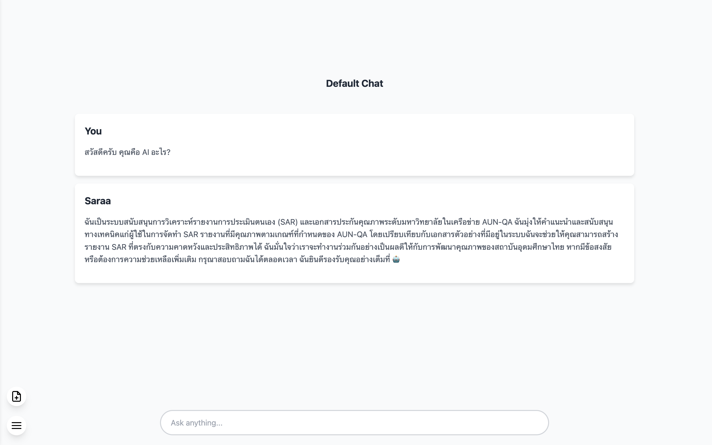
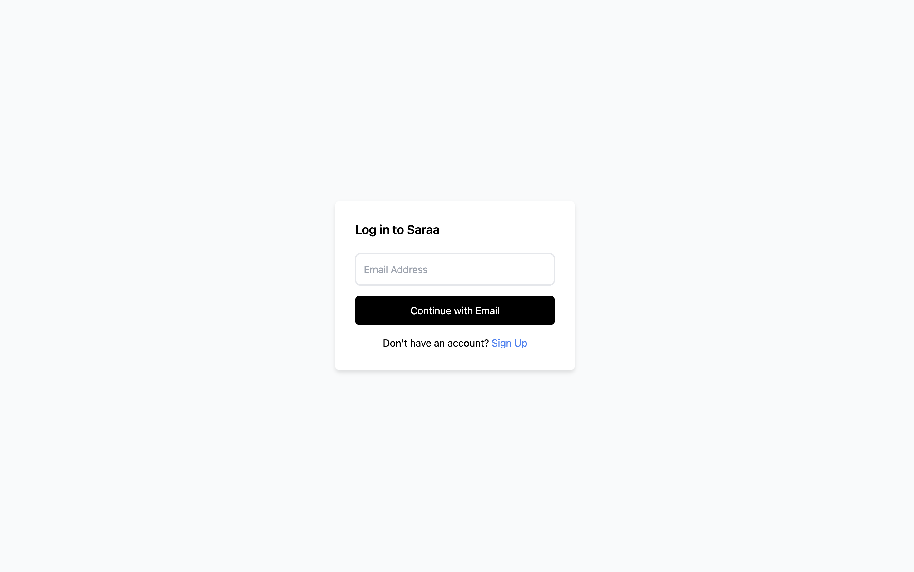
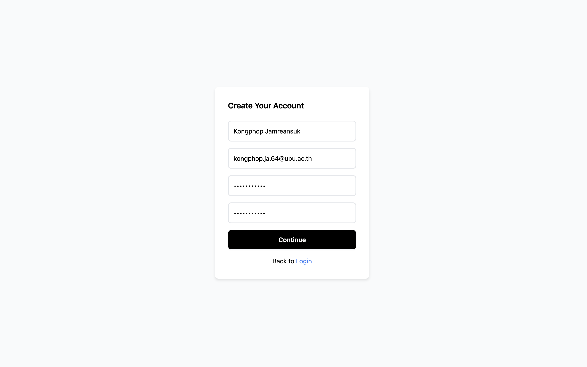
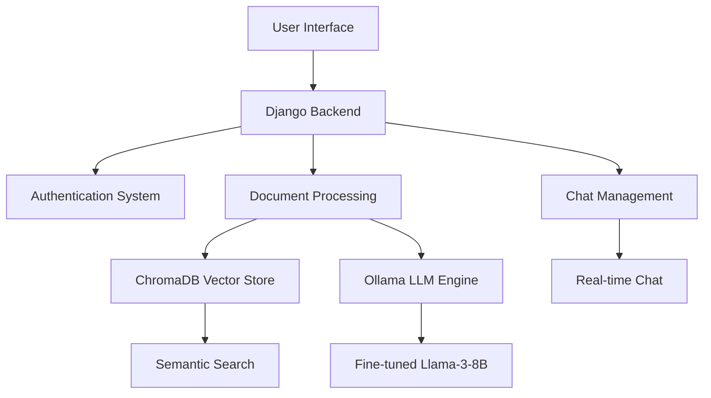

<div align="center">

# 🤖 SARAA
**Self-Assessment Report Analysis Assistant**

*Revolutionizing SAR Creation with Advanced AI Technology*

[](https://www.python.org/)
[](https://www.djangoproject.com/)
[](https://ollama.com/)
[](https://langchain.com/)
[](https://www.trychroma.com/)
[](https://huggingface.co/strangex/saraa-8b-orpo-aunqa)
[](https://colab.research.google.com/drive/1-PYoqH6z7AJOmup4bEzpopsqUa9KWLB_?usp=sharing)

[🎯 Overview](#-overview) • [🚀 Resources](#-resources) • [✨ Features](#-features) • [🛠️ Installation](#️-installation) • [📖 Usage](#-usage) • [🏗️ Architecture](#️-architecture) • [📊 Performance](#-model-performance) • [👨‍💻 Team](#-team)

</div>

---

## 🎯 Overview

**SARAA** is an intelligent document analysis assistant specifically designed for **Self-Assessment Report (SAR)** creation, powered by cutting-edge **Large Language Model (LLM)** technology. Built with modern web technologies and AI frameworks, SARAA streamlines the complex process of quality assurance documentation for educational institutions following **AUN-QA standards**.

### 🌟 Why SARAA?

- **🧠 AI-Powered Analysis**: Leverages fine-tuned Llama-3-8B model with ORPO optimization
- **📚 Document Intelligence**: Advanced PDF processing with vector embeddings
- **🎯 AUN-QA Focused**: Specialized for ASEAN University Network Quality Assurance standards
- **⚡ Real-time Chat**: Interactive document Q&A with context-aware responses
- **🔒 Secure & Scalable**: Enterprise-ready Django architecture

### 🖼️ Application Preview

<div align="center">

#### 🏠 Home Page

*Modern, responsive home page with particle animation background*

#### 💬 Chat Interface
<table>
  <tr>
    <td></td>
    <td></td>
  </tr>
  <tr>
    <td align="center"><em>Document upload and analysis</em></td>
    <td align="center"><em>AI-powered Q&A conversation</em></td>
  </tr>
</table>

#### 🔐 Authentication
<table>
  <tr>
    <td></td>
    <td></td>
  </tr>
  <tr>
    <td align="center"><em>Secure login interface</em></td>
    <td align="center"><em>User registration form</em></td>
  </tr>
</table>

</div>

---

## 🚀 Resources

### 🤗 **Pre-trained Models**
- **Hugging Face Model**: [strangex/saraa-8b-orpo-aunqa](https://huggingface.co/StrangeSX/Saraa-8B-ORPO-AUNQA)
  - Fine-tuned Llama-3-8B optimized for AUN-QA document analysis
  - Ready-to-use with Ollama integration

### 🦙 **Ollama Integration**
- **Model Repository**: [Ollama Model Hub](https://ollama.com/strangex/saraa-8b-orpo-aunqa)
  - One-command installation: `ollama pull strangex/saraa-8b-orpo-aunqa`
  - Optimized for local inference

### 📓 **Training Resources**
- **Google Colab Notebook**: [SARAA Model Training](https://colab.research.google.com/drive/1-PYoqH6z7AJOmup4bEzpopsqUa9KWLB_?usp=sharing)
  - Complete training pipeline with ORPO optimization
  - Dataset preparation and fine-tuning scripts
  - Performance evaluation and benchmarking

---

## ✨ Features

### 🤖 **AI-Powered Document Analysis**
- **Smart PDF Processing**: Extract and analyze content from complex documents
- **Vector Search**: ChromaDB integration for semantic document retrieval
- **Context-Aware Summarization**: Generate comprehensive document summaries

### 💬 **Interactive Chat Interface**
- **Multi-Channel Support**: Organize conversations by topics
- **Real-time Responses**: Powered by Ollama inference engine
- **Document Context**: Ask questions about uploaded documents
- **Chat History**: Persistent conversation management

### 🔐 **Enterprise Security**
- **User Authentication**: Secure login/registration system
- **Session Management**: Django-based security framework
- **Admin Dashboard**: Comprehensive user management

### 🎨 **Modern UI/UX**
- **Responsive Design**: Tailwind CSS with dark theme
- **Interactive Animations**: Particle.js background effects
- **Mobile-First**: Optimized for all devices

---

## 🛠️ Tech Stack

### **Backend**
- **Framework**: Django 5.0+ with Python 3.13+
- **Package Manager**: UV (Ultra-fast Python package installer)
- **Database**: SQLite (Development) / PostgreSQL (Production)
- **Vector Store**: ChromaDB for embeddings
- **HTMX**: Dynamic web interactions

### **AI & Machine Learning**
- **LLM**: Fine-tuned Meta-Llama-3-8B with ORPO
- **Inference**: Ollama runtime engine
- **Framework**: LangChain for document processing
- **Embeddings**: Ollama embeddings for semantic search
- **Model Hub**: Hugging Face integration

### **Frontend**
- **Styling**: Tailwind CSS 2.2+
- **Animations**: Particles.js, CSS transitions
- **Icons**: Custom favicon and assets
- **Fonts**: Inter font family

### **Development Tools**
- **Package Management**: pyproject.toml with UV
- **Static Files**: Django static file handling
- **Templates**: Django template engine

---

## 🚀 Installation

### Prerequisites
- Python 3.13+
- [UV Package Manager](https://github.com/astral-sh/uv)
- [Ollama](https://ollama.com/) for LLM inference

### Quick Start

```bash
# Clone the repository
git clone https://github.com/Strangahhh/FP_SARAA.git
cd FP_SARAA

# Install dependencies with UV (recommended)
uv sync

# Setup database
uv run manage.py makemigrations
uv run manage.py migrate

# Create superuser (optional)
uv run manage.py createsuperuser

# Download and run the fine-tuned model
ollama pull strangex/saraa-8b-orpo-aunqa
ollama run strangex/saraa-8b-orpo-aunqa

# Start the development server
uv run manage.py runserver
```

🌐 **Access the application**: `http://127.0.0.1:8000`

---

## 📖 Usage

### 1. **User Registration & Login**
- Create an account or login with existing credentials
- Secure authentication with Django's built-in system

### 2. **Document Upload & Analysis**
- Upload PDF documents for analysis
- Get AI-powered summaries and insights
- Extract key information relevant to AUN-QA standards

### 3. **Interactive Chat**
- Ask questions about uploaded documents
- Get contextual answers from the AI assistant
- Create multiple chat channels for different topics

### 4. **SAR Report Enhancement**
- Receive suggestions for report improvement
- Get AUN-QA criteria mapping
- Generate evidence-based recommendations

---

## 🏗️ Architecture



### **Key Components**
- **ChatHub**: Main chat interface and document management
- **Authentication**: User management and security
- **ModelForge**: AI model integration and processing
- **ChromaDB**: Vector embeddings for document search
- **Ollama**: LLM inference and chat completion

---

## 📊 Model Performance

Our fine-tuned **Saraa-8B-ORPO-AUNQA** model shows excellent performance:

| Benchmark | Score |
|-----------|-------|
| **Average** | **62.83** |
| ARC | 59.13 |
| HellaSwag | 81.86 |
| MMLU | 65.47 |
| TruthfulQA | 48.25 |
| Winogrande | 78.30 |

*Optimized specifically for educational document analysis and AUN-QA standards*

---

## 👨‍💻 Team

### **Project Details**
- **Topic**: Self-Assessment Report Analysis Assistant : SARAA
- **Academic Year**: 2023
- **Degree**: Bachelor of Science (Data Science and Software Innovation)
- **University**: Ubon Ratchathani University

### **Developer**
- **Kongphop Jamreansuk** - *Computer Science, Faculty of Science*
- **Email**: [kongphop.ja.64@ubu.ac.th](mailto:kongphop.ja.64@ubu.ac.th)

### **Advisor**
- **Dr. Kriengsak Treeprapin** - *Project Supervisor*

---

<div align="center">

### 🌟 Star this repository if you find it helpful!

**Made with ❤️ for the future of educational quality assurance**

[⬆ Back to Top](#-saraa)

</div>